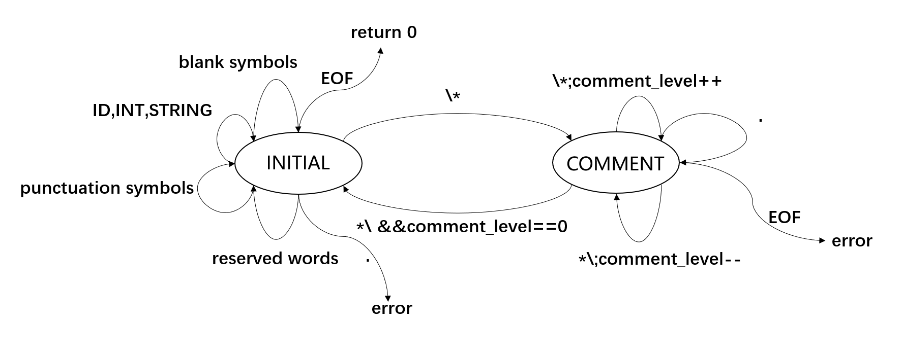

# Lab 2: Lexical Analysis

**This is a implement a lexical analyzer for the Tiger language, and here is the documentation.**

## How do I handle these issues

### comments

1. 状态转移：我定义了两种状态：INITIAL (flex自带)和COMMENT,当读取到"/*"时，会从INITIAL状态转移至COMMENT.
2. 多级comment：我定义了一个uint32_t变量comment_level用来记录comment层数，当遇到"*/"时，会进行判断，若层数为0，则返回至INITIAL; 反之，继续保持在COMMENT状态。
3. 一般处理：用通配符'.',直接adjust()即可。

### strings

首先只有在INITAL状态下会处理strings，且遇到的内容是双引号之间的内容，所以可以用`\"(\\\"|[^"])*\"`来匹配。

当我匹配string时，会用到getstr()函数，在这个函数中会把转义字符转回原有词义。

### error

在INITAIL状态中，因为已经定义了所有的可能情况，所以在最后定义了一个通配符'.'用来输出error;

在COMMENT状态中，若是遇到了`<<EOF>>`，则输出error;

### end-of- file

在INITAIL状态中遇到`<<EOF>>`,会直接return 0；

在COMMENT状态中遇到`<<EOF>>`，会输出error，并return 1；

## Other interesting features

### DFA Graph

### getstr()

这个函数要将转义字符转回原有词义，其中非常有意思的是`\f___f\`，此序列将被忽略，并拼接前后字符串。

在我的实现中，若是遇到了`\f___f\`会自动跳过中间的空白字符和最后一个'\\', 与下一行的STRING相连接。